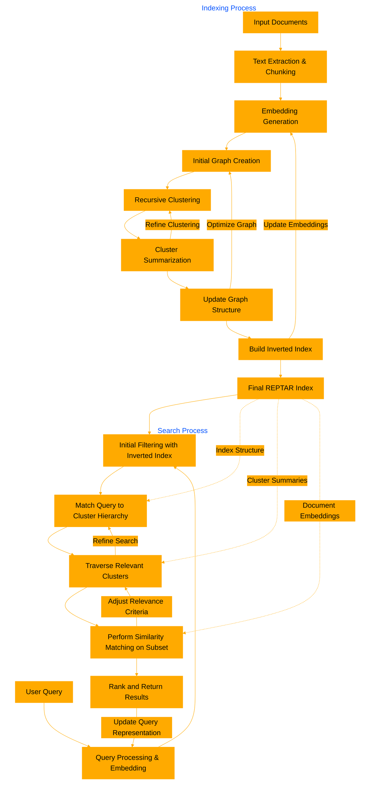

# REPTARindex
A command-line tool for recursive graph-based document indexing and retrieval with hierarchical cluster summaries and inverted keyword indexing.


REPTARindex is a document retrieval framework that employs recursive clustering and graph-based representation. It processes input documents into chunks, generates embeddings, and constructs a hierarchical graph structure. The system creates summaries for each cluster level, enabling efficient multi-level search. During retrieval, it uses an inverted keyword index for initial filtering, then traverses the cluster hierarchy, matching the query against cluster summaries to narrow the search space. This approach significantly reduces computational costs for large document corpora. The framework balances between broad context understanding through cluster summaries and specific detail retrieval from individual document chunks, offering a flexible and efficient solution for various information retrieval tasks.

## Building the Index

1. Prepare your documents in a folder or subfolders.
2. Run the indexing command:

```bash
reptarindex build --input_folder /path/to/documents --output_file index.reptar --chunk_size 200 --overlap 50 --embedding_model all-minilm --max_depth 3 --min_cluster_size 5 --max_clusters 10
```

## Searching

To search the built index:

```bash
reptarindex search --input_file index.reptar --query "Your search query here" --output_file results.json
```

## Parameters

- `chunk_size`: Size of text chunks (default: 200)
- `overlap`: Number of words to overlap between chunks (default: 50)
- `embedding_model`: Model to use for generating embeddings (default: all-minilm)
- `max_depth`: Maximum depth of the cluster tree (default: 3)
- `min_cluster_size`: Minimum number of nodes in a cluster (default: 5)
- `max_clusters`: Maximum number of clusters at each level (default: 10)

Adjust these parameters based on your specific use case and document corpus.



Here's an explanation of how the internal db tree structure might look:

1. Root Level:
   The graph starts with a root node, which represents the entire document collection.

2. Folder Nodes:
   - Directly under the root, you'll have nodes representing the top-level folders in your input directory.
   - Each folder node can have child nodes representing subfolders or document chunks.

3. Document Chunk Nodes:
   - Each document is split into chunks (default size of 200 tokens with 50 token overlap).
   - These chunk nodes are children of their respective folder nodes.
   - Each chunk node contains the text of that chunk, its embedding, and metadata like start and end positions within the original document.

4. Cluster Nodes:
   - The system performs recursive clustering on the document chunks.
   - Cluster nodes are created at various levels, grouping similar chunks together.
   - Each cluster node has:
     - A summary of the content it represents
     - An embedding (average of its children's embeddings)
     - A list of child nodes (which can be other clusters or document chunks)

5. Hierarchical Structure:
   - The clustering process creates a hierarchical structure with a maximum depth (default is 3 levels).
   - At each level, there can be up to 10 clusters (default max_clusters value).
   - Clusters with fewer than 5 nodes (default min_cluster_size) are not further subdivided.

Here's a visual representation of what this tree structure might look like:

```
Root
├── Folder1/
│   ├── Cluster1_1 (Summary: "Topic A overview")
│   │   ├── Cluster1_1_1 (Summary: "Subtopic A1")
│   │   │   ├── Document1_Chunk1
│   │   │   ├── Document1_Chunk2
│   │   │   └── Document2_Chunk1
│   │   └── Cluster1_1_2 (Summary: "Subtopic A2")
│   │       ├── Document2_Chunk2
│   │       └── Document3_Chunk1
│   └── Cluster1_2 (Summary: "Topic B overview")
│       ├── Document4_Chunk1
│       └── Document4_Chunk2
├── Folder2/
│   ├── Subfolder2_1/
│   │   └── Cluster2_1_1 (Summary: "Topic C overview")
│   │       ├── Document5_Chunk1
│   │       └── Document5_Chunk2
│   └── Cluster2_2 (Summary: "Topic D overview")
│       ├── Document6_Chunk1
│       ├── Document6_Chunk2
│       └── Document7_Chunk1
└── Folder3/
    └── Cluster3_1 (Summary: "Topic E overview")
        ├── Document8_Chunk1
        ├── Document8_Chunk2
        └── Document9_Chunk1
```

Key points about this structure:

1. Folders and subfolders maintain the original directory structure.
2. Documents are split into chunks, which become leaf nodes in the tree.
3. Clusters group similar chunks together, creating a hierarchy of topics and subtopics.
4. Each cluster has a summary, providing an overview of its contents.
5. The structure allows for efficient navigation from broad topics to specific document chunks.

This tree structure enables the system to perform efficient searches by:
1. Using the inverted index to quickly find relevant documents based on keywords.
2. Traversing the cluster hierarchy to narrow down the search space.
3. Comparing the query embedding with cluster and document embeddings for similarity-based retrieval.

The hierarchical nature of this structure allows REPTARindex to balance between broad context understanding (through cluster summaries) and specific detail retrieval (from individual document chunks), making it effective for various information retrieval tasks.
