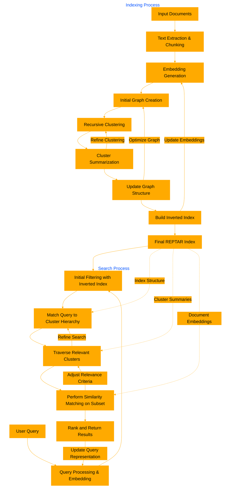

# REPTARindex
A command-line tool for recursive graph-based document indexing and retrieval with hierarchical cluster summaries and inverted keyword indexing.


REPTARindex is a document retrieval framework that employs recursive clustering and graph-based representation. It processes input documents into chunks, generates embeddings, and constructs a hierarchical graph structure. The system creates summaries for each cluster level, enabling efficient multi-level search. During retrieval, it uses an inverted keyword index for initial filtering, then traverses the cluster hierarchy, matching the query against cluster summaries to narrow the search space. This approach significantly reduces computational costs for large document corpora. The framework balances between broad context understanding through cluster summaries and specific detail retrieval from individual document chunks, offering a flexible and efficient solution for various information retrieval tasks.

## Installation

```bash
pip install reptarindex
```

## Building the Index

1. Prepare your documents in a folder or subfolders.
2. Run the indexing command:

```bash
reptarindex build --input_folder /path/to/documents --output_file index.reptar --chunk_size 200 --overlap 50 --embedding_model all-minilm --max_depth 3 --min_cluster_size 5 --max_clusters 10
```

## Searching

To search the built index:

```bash
reptarindex search --input_file index.reptar --query "Your search query here" --output_file results.json
```

## Parameters

- `chunk_size`: Size of text chunks (default: 200)
- `overlap`: Number of words to overlap between chunks (default: 50)
- `embedding_model`: Model to use for generating embeddings (default: all-minilm)
- `max_depth`: Maximum depth of the cluster tree (default: 3)
- `min_cluster_size`: Minimum number of nodes in a cluster (default: 5)
- `max_clusters`: Maximum number of clusters at each level (default: 10)

Adjust these parameters based on your specific use case and document corpus.


